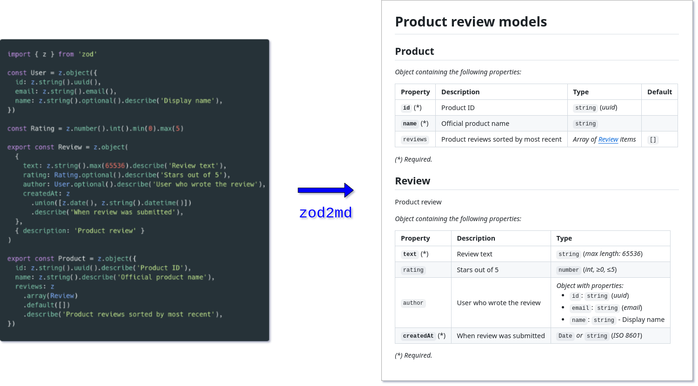

# zod2md

[](https://www.npmjs.com/package/zod2md)
[](https://opensource.org/license/mit/)
[](https://www.npmjs.com/package/zod)
[](https://github.com/matejchalk/zod2md/actions/workflows/ci.yml)

**Generate Markdown docs from [Zod](https://zod.dev/) schemas.**



## Setup

Install the `zod2md` package (optional):

```sh
npm install --save-dev zod2md
```

Run the CLI. The following arguments are required:

- `entry` - path to file which exports Zod schemas,
- `title` - heading text for Markdown document,
- `output` - path where output Markdown file will be generated.

```sh
npx zod2md --entry src/schemas.ts --title "Models reference" --output docs/models.md
```

## Configuration

Although most arguments may be provided directly to the CLI, it may be more convenient to use a configuration file.

For example, create the following `zod2md.config.ts` and then you can simply run `npx zod2md`:

```ts
import type { Config } from 'zod2md';

const config: Config = {
  entry: 'src/schemas.ts',
  title: 'Models reference',
  output: 'docs/models.md',
};

export default config;
```

CLI arguments take precedence over configuration file values.

### CLI arguments

| Option           | Type             | Required | Description                                                         |
| :--------------- | :--------------- | :------: | :------------------------------------------------------------------ |
| `-e`, `--entry`  | `string[]` (\*)  |   yes    | Entry point(s), i.e. paths to modules with Zod schema exports       |
| `-t`, `--title`  | `string`         |   yes    | Heading text for Markdown document                                  |
| `-o`, `--output` | `string`         |   yes    | Output file path where Markdown document will be generared          |
| `--tsconfig`     | `string`         |    no    | Path to `tsconfig.json` to be used when importing entry point(s)    |
| `-f`, `--format` | `'esm' \| 'cjs'` |    no    | Module type to assume when importing entry point(s)                 |
| `-c`, `--config` | `string`         |    no    | Path to configuration file (default is `zod2md.config.{ts,mjs,js}`) |
| `-h`, `--help`   | `boolean`        |    no    | Display CLI help and exit                                           |

(\*) Use `--entry PATH_1 --entry PATH_2` to provide multiple paths.

### Configuration file reference

| Property        | Type                                                  | Required | Description                                                                                |
| :-------------- | :---------------------------------------------------- | :------: | :----------------------------------------------------------------------------------------- |
| `entry`         | `string \| string[]`                                  |   yes    | Entry point(s), i.e. paths to modules with Zod schema exports                              |
| `tsconfig`      | `string`                                              |    no    | Path to `tsconfig.json` to be used when importing entry point(s)                           |
| `format`        | `'esm' \| 'cjs'`                                      |    no    | Module type to assume when importing entry point(s)                                        |
| `title`         | `string`                                              |   yes    | Heading text for Markdown document                                                         |
| `transformName` | `(name: string \| undefined, path: string) => string` |    no    | Custom function for convert exported variable `name` and file `path` to display title (\*) |

(\*) Default is to strip `Schema`-suffix and convert to _PascalCase_ (e.g. `userSchema` becomes `User`). In case of a default export, the file path is used.

## Programmatic usage

It's also possible to import the core `zod2md` function to generate the Markdown string in your own code:

```ts
import { zod2md } from 'zod2md';

const markdown = await zod2md({
  entry: 'src/schemas.ts',
  title: 'Models reference',
});
```

## Examples

A few examples of inputs and outputs are provided (used in E2E tests):

| Example                                                | Source files                                                | Generated docs                                                                                 |
| :----------------------------------------------------- | :---------------------------------------------------------- | :--------------------------------------------------------------------------------------------- |
| [Prettier](https://prettier.io/) config file           | [e2e/fixtures/prettier](./e2e/fixtures/prettier/)           | [e2e/\_\_snapshots\_\_/prettier-example.md](./e2e/__snapshots__/prettier-example.md)           |
| [Commitlint](https://commitlint.js.org/) config object | [e2e/fixtures/commitlint](./e2e/fixtures/commitlint/)       | [e2e/\_\_snapshots\_\_/commitlint-example.md](./e2e/__snapshots__/commitlint-example.md)       |
| User REST API                                          | [e2e/fixtures/user-rest-api](./e2e/fixtures/user-rest-api/) | [e2e/\_\_snapshots\_\_/user-rest-api-example.md](./e2e/__snapshots__/user-rest-api-example.md) |

## Contributing

- Install dependencies with `npm install`.
- Run unit tests with `npm test` (uses [Vitest](https://vitest.dev/)).
- Run E2E tests with `npm run e2e` (uses [Vitest](https://vitest.dev/) and [Verdaccio](https://verdaccio.org/)).
- Build library with `npm run build` (uses [tsup](https://tsup.egoist.dev/)).
- Release new version with `npm run release` (uses [release-it](https://github.com/release-it/release-it?tab=readme-ov-file)).
